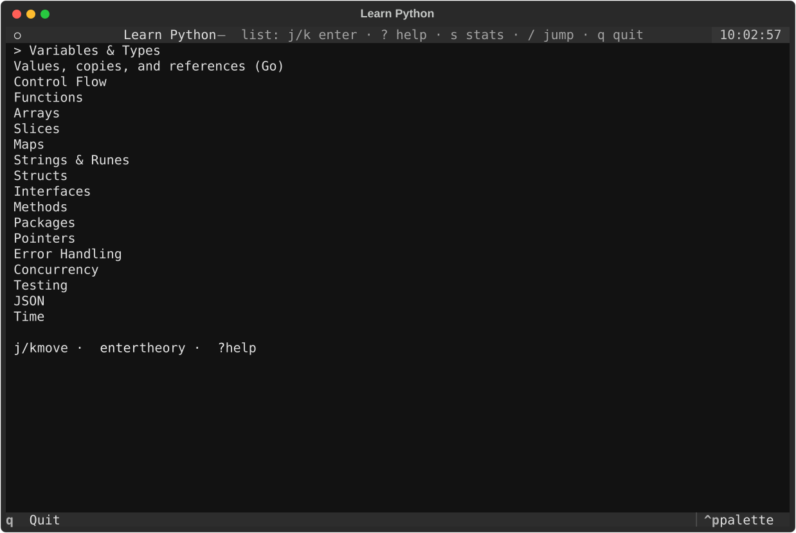

# LEARN-LANGUAGES

> **Testing status:** Chapter reference solutions have been checked with each track’s automated **`check_solutions`** (and related tooling where present). The courses have **not** been manually play-tested end-to-end yet—expect rough edges in UI copy, exercise ordering, or platform-specific behavior until a full human pass.

Monorepo of interactive terminal courses that share one **chapter JSON schema**, a single **[CURRICULUM.md](CURRICULUM.md)** outline, and **[TUTORIAL_PLATFORM.md](TUTORIAL_PLATFORM.md)** rules (grading, hints, authoring quality).

Clone once; each track lives in its own subdirectory with its own TUI/toolchain.

| Track | Directory | Typical run |
|-------|-----------|-------------|
| Rust | [`rust/`](rust/) | `cargo run` |
| Go | [`go/`](go/) | `go run .` |
| C | [`c/`](c/) | `python -m learn_c_tui` |
| C# | [`csharp/`](csharp/) | `python -m learn_cs_tui` |
| Python | [`python/`](python/) | `python -m learn_python_tui` |
| Java | [`java/`](java/) | `python -m learn_java_tui` |
| x86-64 asm (NASM / ELF64) | [`asmx64/`](asmx64/) | `cargo run` |

## Runtime requirements (summary)

Each track’s **`README`** is authoritative. At a glance:

| Track | Run the TUI | Grade / execute learner code | Optional |
|-------|-------------|------------------------------|----------|
| **Rust** | `rustc`, `cargo` (on `PATH`) | same + temp `rustc` / `cargo` per exercise rules | `EDITOR`; **`python3`** only for `scripts/check_solutions.py` |
| **Go** | **Go 1.20+** (`go version` at startup) | `go run` on a temp `main.go` | `EDITOR` |
| **C** | **Python 3.10+**, Textual (`pip install -e …`) | **`cc`** or **`gcc`** (C11) | `EDITOR` |
| **C#** | **Python 3.10+**, Textual | **.NET SDK** — TUI: `build` + `run --no-build`; checker: parallel `exec` (see **`csharp/README`**) | `EDITOR`; **`python3`** for `scripts/check_solutions.py` |
| **Python** | **Python 3.10+** (also runs learner code) | same interpreter | `EDITOR` |
| **Java** | **Python 3.10+**, Textual | **JDK 17+** (`javac`, `java`) | `EDITOR` |
| **asmx64** | **Rust** (`cargo` to build the TUI) | **nasm**, **ld**, **gcc** (Linux / WSL2) | **`python3`** for `scripts/check_solutions.py` |

## Platform support (v1)

Legend: **Yes** = supported for the course TUI and exercise checks; **WSL** = use Windows Subsystem for Linux; **No** = not supported in v1.

| Track | Linux | macOS | Windows (native) | Notes |
|-------|:-----:|:-----:|:----------------:|-------|
| **Rust** | Yes | Yes | Yes | [rustup](https://rustup.rs/) on all three |
| **Go** | Yes | Yes | Yes | `go` on `PATH` |
| **C** | Yes | Yes | No | **`cc`/`gcc`** (POSIX); **not** MSVC — use **WSL2** on Windows |
| **C#** | Yes | Yes | Yes | [.NET SDK](https://dotnet.microsoft.com/download) |
| **Python** | Yes | Yes | Yes | Python 3.10+ |
| **Java** | Yes | Yes | Yes | JDK 17+ |
| **asmx64** | Yes | No | No | **ELF64 / NASM / GNU `ld`** — Linux only; on Windows use **WSL2** |

Details and caveats: each track **`README`** (sections **Platform** or **Requirements**).

## Shared docs

| Doc | Contents |
|-----|----------|
| **[CURRICULUM.md](CURRICULUM.md)** | Chapter order (`01_` … `19_`), ids, coverage matrix |
| **[TUTORIAL_PLATFORM.md](TUTORIAL_PLATFORM.md)** | JSON schema, stdout checks, authoring rules |

**VS Code / Cursor:** **File → Open Workspace from File…** and choose **[`learn-languages.code-workspace`](learn-languages.code-workspace)** at the repo root (folder path is **`.`**, portable across machines).

## Authoring

Chapter JSON lives in **`./chapters/`** under each language directory (sorted by filename). Edit those files in place for that track; there is no repo-root generator that copies chapters from another language.

Each track’s **`scripts/check_solutions.py`** verifies bundled reference solutions. See that track’s **`README`** for flags and work directories.

**Pedagogical quality** (real computation in solutions, scaffolds in starters, language-appropriate theory) is required; see **CURRICULUM.md**.
